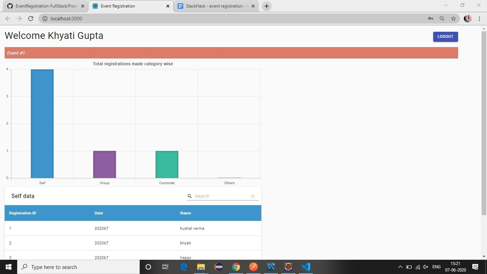

# EventRegistration

**DEMO LINK :** https://eventregistration-stackhack.web.app/

What's the prototype/overview of our website?
1) Initially we have the registration form for the event, where the event is fixed as of now in
the frontend.
2) For event registration we gave user the option to choose what type of booking he/she
want’s to make:
a. Self -
● If the person is booking for himself/herself.
b. Group -
● If the person wants to book tickets for a group.
● User has the choice to either include him/her or not.
● Total tickets have to be more than 1.
● From the backend we will check if any user among the group has any
previous booking of any type already made.
● In this case skipping that member, the rest of the other people will be
considered for booking.
c. Corporate-
● It’s much like a group booking.
● For verification we may add the functionality to verify the organization
email id in future.
● User has the choice to either include him/her or not.
● Total tickets have to be more than 1.
● From the backend we will check if any user among the group has any
previous booking of any type already made.
● In this case skipping that member, the rest of the other people will be
considered for booking.
