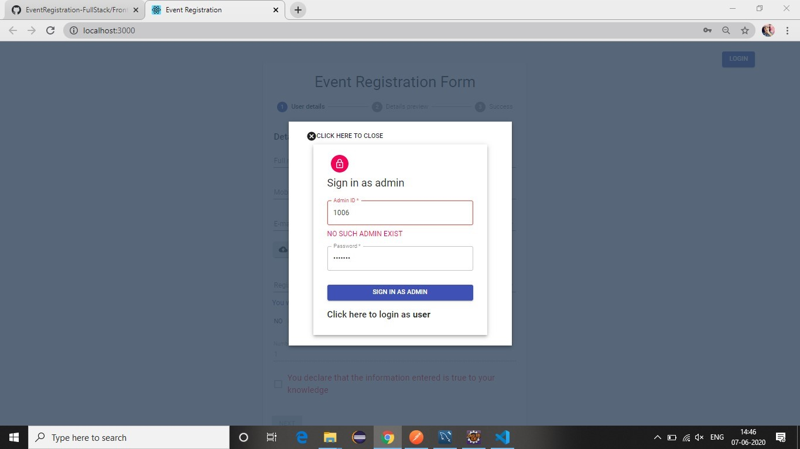

# EventRegistration

**DEMO LINK :** https://eventregistration-stackhack.web.app/

**overview of the website?**
1) Initially we have the registration form for the event.

2) For event registration we gave user the option to choose what type of booking he/she
want’s to make:
a. Self -
● If the person is booking for himself/herself.

b. Group -
● If the person wants to book tickets for a group.
● User has the choice to either include him/her or not.
● Total tickets have to be more than 1.
● From the backend we will check if any user among the group has any
previous booking of any type already made.
● In this case skipping that member, the rest of the other people will be
considered for booking.

c. Corporate-
● It’s much like a group booking.
● For verification we may add the functionality to verify the organization
email id in future.
● User has the choice to either include him/her or not.
● Total tickets have to be more than 1.
● From the backend we will check if any user among the group has any
previous booking of any type already made.
● In this case skipping that member, the rest of the other people will be
considered for booking.
d. Others -
● This is a special case where users can make booking for someone else
too.
● The person making the booking might or might not include him/her in the
booking process.
● Users can book even 1 ticket under this category.
3) An account will be automatically created whenever a new user makes any booking for
any event.
4) Account related credentials will be mailed to the person who does the bookings.

5) User has to upload his/her IdProof (with a restriction that the file should be a jpeg or png
and file size less than 500kb).
We preview the details along with the Id proof that the user uploaded.

6) Upon confirmation the booking is made and tickets along with a QR (that could be used at
the event location to verify the user) will be mailed to the person.

7) Also a text message will be sent to the user’s mobile number showing the minimal
necessary details of the event.

8) We have implemented the login forms for users and admin.

9) Admin can login and check their dashboard for detailed information of every booking or
every event.
10) A chart is shown to the admin for every event.

11) That chart represents the total count of the registrations made for that corresponding
event based on the types (self, group, corporate, others).
12) Admin can click on each bar to populate tables for each type.
13) Table shows the unique registration Id, date and name of the person who made the
booking.

14) Upon clicking on any row a modal will open up showing the details related to that
registration Id.

15) When user tries to log in:
a. If a user account doesn’t exist with the entered mobile number he/she will be
notified to create an account. (user signup form will be created in future)

b. If a user enters incorrect password the password field is highlighted with error
and incorrect password message will be displayed.

c. If a user enters correct credentials he will be redirected to their dashboard.
16) Almost all the edge cases for event registration form are covered:
a. Validations at every necessary field.
b. Users can’t proceed further without filling out all the details including the nested
group details.
c. For booking type “Other” there can be a booking for even 1 user, whereas for
group and corporate bookings there is restriction of ticket count more than 1.
d. Checkbox at the end of the form is used to verify that all the details are filled
correctly.
e. In any way if users try to manipulate the booking form it is well handled in the
frontend and backend to their levels.
f. Incorrect login attempts are notified.
g. Details of login cleared out once the user logout.
**What’s the vision?**
1. The type of events our site provides are awareness, social cause, hackathons, seminars,
educational and training camps.
2. This Site consists of two portals Admin and User.
3. Admin manages the site by adding events, updating events, and analyzing the bookings
being made for events on their dashboard.
4. Admin accounts can’t be created by any other person, it can only be created by other
admins and the credentials to that account will be forwarded to the person's email ID
whose account was created.
5. Users can make bookings for various ongoing events. And view their booking history by
logging into their account on our site. If the person does not create an account and
directly makes a booking the account will be created automatically and the credentials
will be mailed to the person‘s email. The user can login and reset the password.
6. Most of the edge cases are covered related to event registration from backend as well as
frontend.
**BACKEND PART**  (FOR DETAILED WORKING REFER THE DOCUMENT)
**Tool/Software:** MySql Workbench , Eclipse IDE, Postman
**Frameworks:** Maven, Spring Framework,Hibernate ORM, Spring MVC ,Restful-web
services
**JRE library:** JavaSE-1.8
**Server:** apache-tomcat-9.0.34
**Technologies:** MySQL,J2EE
**Website connection:** Gmail (for sending booking details and account creation on mail)
,Fast2sms (for sending booking confirmed notification on sms)
**To be added:** Spring Security
**Basic Storage Structure:**
1. Details to be stored and maintained in the database about the user (Full Name, Phone
number, Email, Password, Booking details (booking history) ).
2. Details to be stored and maintained in the database about booking details(booking ID,
Full Name, Phone number, Gender, Email, Booking date, ID card, Booking type
( self/group/corporate/others),Event for which booking is being done, Number of people
for which booking is being done, List of details of people whose booking is being done).
3. Details to be stored and maintained in database about the event(ID, Name, About, Total
number of seats available, Number of seats left, Event date, Event type (online/live) , List
of bookings made for the event, List of people registered for event)
4. Details to be stored and maintained in a database about admin(ID, name, mobile, email,
password).
5. Details to be stored and maintained in a database about People(Phone number, name,
gender).
Key points: Gender was taken for future purpose when the website may organize gender
specific events. Like Women hackathon.

**FRONTEND PART**
**Tool/Software:** Visual studio code, codesandbox
**Technologies:** reactJS, materialUI, http-proxy-middleware, axios, react-chartjs-2
**Basic requirements:**
1. Details to be taken from user (fullName, mobile number, e-mail, ID card, gender,
registration type, no. of tickets)
2. Registration type should have - self/group/corporate/others.
3. Preview details to the user before submitting.
4. Upon submission show a unique auto generated registration number to the user.
5. Maintain an admin login.
For admin UI:
1. Chart showing count of registration types.
2. List all registrations showing registration number, date and name.
3. Hyperlink on registration number.
How to Implement/run frontend:
1. Open the downloaded folder in visual studio code.
2. Go to the terminal and type “npm update” - in case any compatibility issues occur, they
will be resolved on its own.
3. Type “npm start” - files will be compiled and development server will begin.
4. Wait for output on the browser at http://localhost:3000/
5. Ensure the backend is running fine before doing anything on the frontend.
Functionalities for people of different roles:
Person making the booking:
1. Has the option to select the registration type from self/group/corporate/others.
2. For self the total number of tickets is fixed to 1.
3. For rest types the user has to enter a total number of tickets he/she wants.
4. Group button is enabled once the user enters the correct number of tickets.
5. Upon checking the checkbox all fields are checked if any is left empty.
6. Details are previewed to the user before making the final submission.
7. Upon confirmation the final booking component is loaded with registrationId and booking
date retrieved from the backend.
8. Success message with some additional information is displayed.
9. An account of the person making the booking is created with a random password and
mailed to the user.
Admin:
1. Upon successful login admin dashboard consists of all the necessary details.
2. A chart is used to show the count of total booking made for each registration type
(self/group/corporate/others).
3. Multiple charts will be populated when there are bookings for multiple events.
4. When admin clicks on each bar the corresponding data is displayed in a table beneath
the chart.
5. In cases of group/corporate/others a nested table will be displayed when admin clicks on
each row.
6. Hyperlink to each registrationId is added to fetch the booking information associated with
that registrationId.
User(person who made the booking):
1. After successful booking an account of the person is created.
2. User logs in with the credentials mailed to him/her.
3. Users have to reset their account password.
4. Users can see for what events they have made any bookings for.
5. Users can see/download their ticket they booked, for every event.
6. Users can see their group details (in case the booking was made for the same).
Workflow of frontend:
1. Index.js file renders App.js
2. App.js loads LandingPage.jsx as the initial web page being displayed.
3. LandingPage.jsx returns “login/logout button”, “user login form”, “admin login form” and
FormDataInput.jsx
4. If admin logs in, a child component called AdminDashboard.jsx is rendered within
LandingPage.jsx else if the user logs in, a child component called UserDashboard.jsx is
rendered.
5. FormDataInput.jsx manages the rendering of UserDetails.jsx or DetailsPreview.jsx or
ConfirmBooking.jsx
6. FormDataInput.jsx is the parent for all those three components.
7. UserDetails.jsx is taking form values input from the user.
8. DetailsPreview.jsx is previewing all the details filled by the user and the Id Card too.
9. ConfirmBooking.jsx sends the request to the backend with the details the user filled in
the form and receives a response/error.
10. When a successful response is received the registration ID and booking Date is
displayed to the user with some extra useful information.
11. An option to make another booking is given that reloads the main page again as a fresh
entry point.
12. On AdminDashboard.jsx we have a bar chart that shows the total count of registrations
made.
13. On clicking each specific bar the corresponding table is loaded showing all registrations
made for that type.
